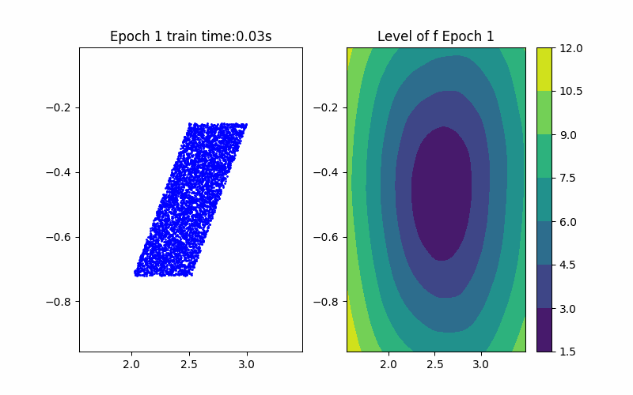
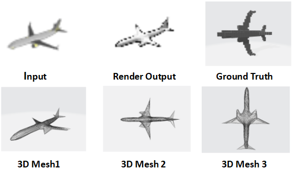
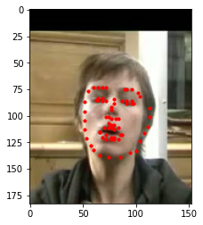

## Research Projects

    

            
            
Data-Driven Reachability Analysis

    

## Course Projects

    

        
        
MLDL Project: Self-Supervised 3D Shape Reconstruction

    

    

        
        
ML Project: Facial Landmark Detection

    

