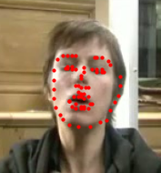

## Research Projects

    

            
            
Data-Driven Reachability Analysis

    

## Course Projects
<table>
  <tr>
    <td>
      <a href="https://github.com/kchen127/Self_Supervised_3D_Shape_Reconstruction" target="_blank">
        Self-Supervised 3D Shape Reconstruction" style="width: 45%; vertical-align: middle; margin-right: 10px;">
      </a>
      <a href="https://github.com/RuolingFan/Facial-Landmark-Detection" target="_blank">
        Facial Landmark Detection" style="width: 45%; vertical-align: middle;">
      </a>
    </td>
  </tr>
</table>

