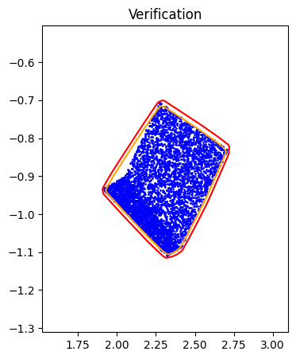
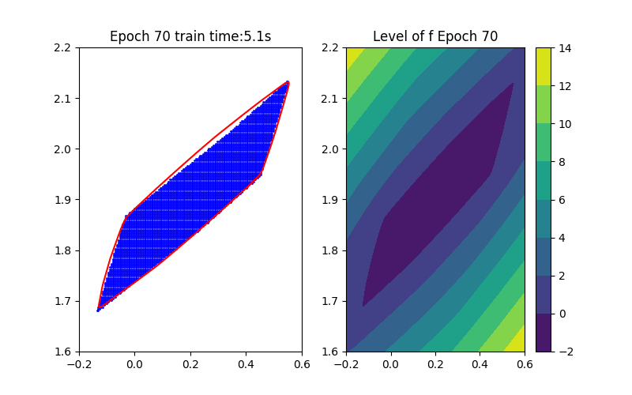
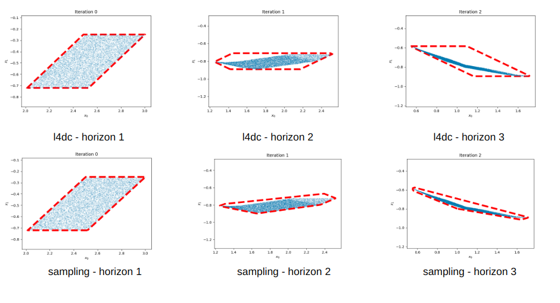

    

        
    

    

        
    

    Step 1: Training Procedure | Step 2: Verification

# Introduction
This project aims to develop a data-driven approach for reachability analysis of neural network-controlled systems.
Reachability analysis is crucial in understanding and predicting the behavior of these complex systems, which has broad applications in fields like autonomous vehicles and robotics.
Traditional methods often face challenges in handling the non-linear and high-dimensional nature of neural network-controlled systems.
Our project introduces a novel data-driven approach that leverages the power of Input-Convex Neural Networks (ICNNs) for fast convex hull approximation. 
This method stands out as it offers a more scalable and adaptable solution compared to conventional techniques, 
the latter often being limited by computational constraints and lack of flexibility.

Our current contributions include:

1. Fast Convex Hull Approximation: We propose a data-driven approach utilizing Input-Convex Neural Networks (ICNNs) for fast convex hull approximation, 
which significantly enhances computational efficiency while maintaining high accuracy.

2. Verification via Optimization: The approximations we achieve are verified through an optimization problem, 
ensuring reliability and robustness in our approach.

# Background

### [Input-Convex Neural Networks (ICNNs)](https://arxiv.org/abs/1609.07152)

Our method heavily relies on Input-Convex Neural Networks (ICNNs), which are neural networks with convexity with respect to their inputs:

$$
z_{i+1} = g_i(W^{(z)}_i z_i + W^{(y)}_i y_i + b_i), \\
f_{\theta}(y) = z_k
$$

where $$z_0, W^{(z)}_0 \equiv 0$$, all $$W^{(z)}_{1:k-1}$$ are non-negative, 
$$\theta=\{W^{(y)}_{0:k-1}, W^{(z)}_{1:k-1}, b_{0:k-1} \}$$ are the parameters, 
and $$g_i$$ are convex and non-decreasing nonlinear activation functions (e.g. ReLU).

### [Neural Network Representation of Discrete-Time Neural Network-Controlled Systems](https://proceedings.mlr.press/v211/entesari23a.html)

This paper shows that a discrete-time neural network-controlled system can be exactly represented by a neural network.

$$
    x_{k+1} = A x_k + B \pi(x_k) + c = F(x_k)

$$

where $$x_k \in \mathbb{R}^n$$ is the state at time step $$k$$, $$F$$ and $$\pi$$ are two neural networks, $$A, B$$ and $$c$$ are system dynamics.

# Problem Formulation
Based on the above background, the closed-loop system can be exactly represented by a neural network,

$$
    x_{k+1} = F(x_k) 
$$

hence the state at time step $$k$$ can be represented by $$k$$-time composition of the neural network, as a new neural network, in terms of the initial state $$x_0$$:

$$
    x_k = F^k(x_0)
$$

This displays that multiple-step reachability analysis can be done starting at $$x_0$$ by multiple-step composition of the neural network, which is still a neural network.
So the reachability analysis problem is essentially computing the image or preimage of a set under some neural network.

From now on we assume that our system is a neural network, denoted as $$S$$, we address the following problems:
1. **(Forward Reachability)** Given an initial set $$X$$, find a tight over-approximation of its image $$S(X)$$
2. **(Backward Reachability)** Given a target set $$Y$$, find a tight over-approximation of its preimage $$S^{-1}(Y)$$

We further assume that both $$X$$ and $$Y$$ are convex polytopes.
The first problem is well-studied, and there are many existing methods to solve it, including 
[CROWN](https://proceedings.neurips.cc/paper/2018/hash/d04863f100d59b3eb688a11f95b0ae60-Abstract.html) and [DeepPoly](https://dl.acm.org/doi/pdf/10.1145/3290354).
However, the second problem is much more challenging, especially when the activation function is not injective (e.g. ReLU).
To develop a general framework on both forward and backward directions, we propose a data-driven approach 
to solve the two problems. 

Given a sampled dataset $$Z$$ obtained from either $$S(X)$$ or $$S^{-1}(Y)$$, 
our approach mainly contains two steps:
1. Approximation: learn the convex hull shape by an ICNN
2. Verification: verify the approximation via an optimization problem

# Method
From the above background, an ICNN is a convex mapping with respect to its input. Moreover, an ICNN with 
Continuous Piecewise Affine (CPA) activation functions (e.g. ReLU, Leaky ReLU) is in essence a max-affine function.
Hence, it has the capability to approximate the convex hull of a dataset. This can be done by training the ICNN such that
the induced level-set polytope contains the dataset while the polytope volume is minimized.

$$
\begin{aligned}
\min_{\theta} &\quad \text{Vol}(P_{\theta}) \quad(\text{Volume Minimization Objective})\\
    \text{s.t.} &\quad Z \subseteq P_{\theta}  \quad (\text{Set Inclusion Constraint}) \\
                &\quad P_{\theta}  = {\{x \in \mathbb{R}^n | f_{\theta}(x) \leq 0\}}
\end{aligned}
$$

where $$f_{\theta}$$ is an ICNN with parameters $$\theta$$, and $$Z$$ is the sampled dataset.
Noting that without loss of generality, we fix the level set value to be $$0$$ since this is a just bias shift on ICNNs.

## Training
Given an ICNN, we train it such that the polytope boundary matches as closely as possible to the true
data convex hull, which is done by minimizing the following loss functions:

### Data Inclusion Loss
This loss ensures that the polytope contains the dataset. The design of this loss term is intuitive,
with the general idea that all the data points should have function values less than or equal to zero.
Therefore, one possible choice for the loss term is 

$$ L(z; \theta) =  \text{sigmoid} (f_\theta(z)) $$

as $$L(z; \theta) \to 0$$ for every $$z \in Z$$, the approximated polytope $$P_{\theta}$$ contains the dataset $$Z$$.

### Volume Minimization Loss
This is the most challenging part of the training, since it is hard to directly express the volume of a polytope.
To overcome this difficulty, we introduce the distance of an inner point $$z$$ to the polytope boundary as

$$
\begin{aligned}
d(z, \partial P_\theta) = \max_{q} & \quad ||q-z||^2  \\
    \text{s.t.} &\quad f_\theta (q) \leq 0 \\
\end{aligned}
$$

and the volume of the polytope can be expressed as $$\sum_{z} d(z, \partial P_\theta)$$.

However, the above problem is still hard to solve, since it is a non-convex optimization problem. We propose several approximate forms that are
much more tractable, where the following method is the most efficient one.

Consider a given data point $$z \in Z$$ and unit direction $$v$$, the distance to the polytope boundary can be expressed as

$$
\begin{aligned}
d_v(z, \partial P_\theta) = \max_{\alpha} & \quad \alpha \\
    \text{s.t.} &\quad f_\theta (z+\alpha v) \leq 0 \\
                & \quad \alpha \geq 0
\end{aligned}
$$

Based on the convexity of $$f_\theta$$ and the constraints $$f_\theta (q) \leq 0$$, it's fair to assume that $$f_\theta (z+\alpha v)$$ is positive for large enough $$\alpha$$.
Thus, we apply a binary search on $$\alpha$$ to find the largest $$\alpha$$ with $$f_\theta (z+\alpha v) \leq 0$$.
It is notable that this method is gradient-based and would allow the parent optimization problem minimzing the sum of distances to propagate gradients to update $$\theta$$.
However, we experimentally find that this does not yield desireable results since the optimal $$\alpha$$ does not provide valuable gradient information for the parent optimization problem.

To overcome this, after finding the optimal $$\alpha$$, instead of minimizing these $$\alpha$$'s with respect to $$\theta$$ and applying backpropagation,
we maximize the function values at this point. The intuition behind this is that
if the boundary moves away from the data point, we should discourage this by enlarging the function value so that the zero level set squeezes towards the data point.

$$ L(z; \theta) =  -\text{sigmoid} (f_\theta(z+\alpha^* v))$$

### Lipschitz Loss
This part is for ease of the following verification step by regularizing the Lipschitz constant of the ICNN.
By avoiding the dramatic change of neural network values, the aim of this loss term is to make the optimal value of the following verification optimization problem as small as possible.

## Verification
Given a well-trained ICNN $$f$$, we can verify its approximation by solving the following optimization problems:
### Forward Reachability

$$
\begin{aligned}
\max_{x} &\quad f(S(x)) \\
    \text{s.t.} &\quad x \in X
\end{aligned}
$$

It is notable that both $$f$$ and $$S$$ are neural networks, so is the composition. 
And the above optimization problem is essentially a neural network verification problem, where many frameworks provide accurate and efficient estimation on the optimal value.

### Backward Reachability
The backward reachability verification is more tricky, since it involves two neural networks, one occurs in the objective function and the
other occurs in the constraint.

$$
\begin{aligned}
\max_{x} &\quad f(x) \\
    \text{s.t.} &\quad AS(x) \leq b \quad (\text{our assumption on convex polytope}) \\
\end{aligned}
$$

Solving this optimization problem is in general intractable. Instead, we relax it.
The key idea is to replace $$S(x)$$ with some terms containing $$x$$, then the problem becomes a neural network verification problem again.

# Results

Blank part: results of fast convex hull approximation in high dimensions [TO BE FILLED]

We perform our method on Double Integrator model. 
### Forward Reachability 
The baseline method is [AutomatedReach](https://proceedings.mlr.press/v211/entesari23a.html).
<table>
  <tr>
    <td style="padding-right: 10px;"> Horizon 1: Training</td>
    <td style="padding-right: 10px;"> Horizon 1: Verification</td>
    <td> Horizon 1: Baseline</td>
  </tr>
  <tr>
    <td style="padding-right: 10px;"> Horizon 2: Training</td>
    <td style="padding-right: 10px;"> Horizon 2: Verification</td>
    <td> Horizon 2: Baseline</td>
  </tr>
  <tr>
    <td style="padding-right: 10px;"> Horizon 3: Training</td>
    <td style="padding-right: 10px;"> Horizon 3: Verification</td>
    <td> Horizon 3: Baseline</td>
  </tr>
</table>

### Backward Reachability (Under Implementation)
Verification part is still not completed yet. The baseline method is [INVPROP](https://arxiv.org/abs/2302.01404).
<table>
  <tr>
    <td>
      
      
       Horizon 1: Training | Horizon 1: Baseline
    </td>
  </tr>
  <tr>
    <td>
      
      
       Horizon 2: Training | Horizon 2: Baseline
    </td>
  </tr>
  <tr>
    <td>
      
      
       Horizon 3: Training | Horizon 3: Baseline
    </td>
  </tr>
</table>

# Current and Future Work
- Efficient Sample Strategy: this is extremely important for preimage approximation. Since we do not have a *priori* knowledge on the preimage set, 
we usually need to sample a large number of points to cover the preimage set. However, this is not efficient; we are working on this. An ideal
solution is to sample the points on the boundary of the image/preimage set, which is hard to obtain. Another solution is 
to ensure that points are uniformly sampled in the image/preimage set, which is also very challenging.

- Disconnectivity of the preimage set: due to the non-injectivity of the activation function, the preimage set can be disconnected.
The current solution proposed in other papers for reducing conservativeness is partitioning. However, this is not efficient under our framework since
we need to train a new ICNN for each partition.

- Verification on the preimage approximation: we relax the preimage approximation problem and hence introduce conservativeness.
As this part of the research is still in progress, the extent of conservativeness introduced remains to be determined.

Hidden part: some discarded ideas and results

Our initial approach involved parameterizing a polytope for over-approximation, developing a multi-step training procedure inspired by the theory of Support Vector Machines (SVM). Due to various reasons, this idea was eventually discarded in favor of the method currently being pursued.
  
Some results from the initial approach are presented below:

<ul style="list-style-type: none;">
  <li>
    

      <strong>Forward Reachability:</strong>
      

        
        
The bottom figures represent our results for forward reachability.

      

    

  </li>
  <li>
    

      <strong>Backward Reachability:</strong>
      

        
        
The bottom figures represent our results for backward reachability.

      

    

  </li>
</ul>

